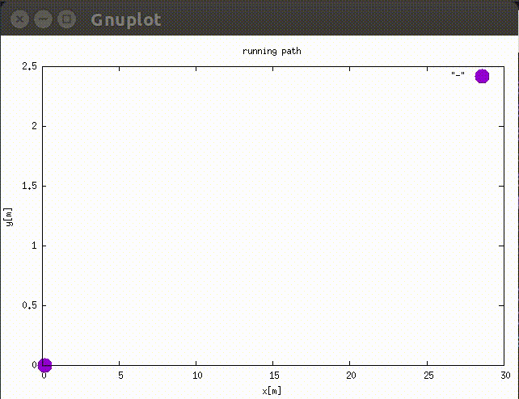

# vehicle-simulation

[](https://opensource.org/licenses/MIT)


Vehicle simulation program using vehicle model of front wheel steering.

## Description

Depending on input target velocity and steering angle, the running path is displayed as the output result below.



## Requirements

- C++11
- g++ 4.9.4 (g++ -dumpversion)
- gnuplot 5.0

## Installation
```bash
git clone git@github.com:takuya-ki/vehicle-simulation.git --depth 1 && cd vehicle-simulation && make DriveSim  
```

## Usage
```bash
./DriveSim
```

## Author / Contributor

[Takuya Kiyokawa](https://takuya-ki.github.io/)

## License

This software is released under the MIT License, see [LICENSE](./LICENSE).
